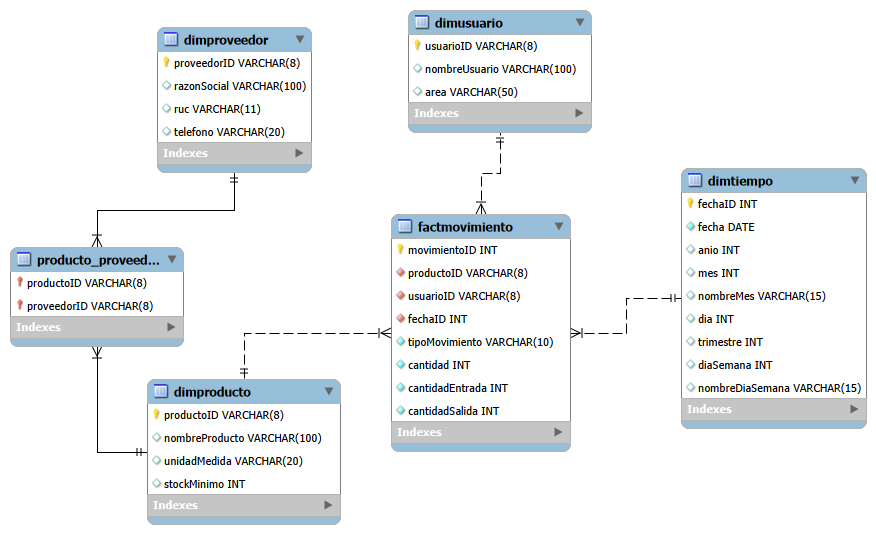

# Data Warehouse — Almacén de Laboratorio Clínico (MySQL)

Diseño e implementación de un Data Warehouse (esquema estrella) para analizar el inventario de un almacén de laboratorio clínico: stock por producto, movimientos por periodo de tiempo, etc. Construido a partir de un modelo OLTP de control de inventario (productos, proveedores, usuarios, movimientos de entrada y salida).




## Contenido

```
sql/
  00_oltp_almacen_laboratorio.sql   -> crea y llena el OLTP (fuente)
  01_dw_almacen_lab_ddl.sql         -> crea el Data Warehouse dw_almacen_lab (diseño propio)
  02_migracion_oltp_to_olap.sql     -> ETL: carga dimensiones, genera dimTiempo, carga FactMovimiento

article/
  Articulo_DataWarehouse_AlmacenLab.docx      -> artículo con el paso a paso de la migración (para Medium)

diagrams/
  star_schema_lab.png   -> esquema estrella del Data Warehouse
```

## Cómo ejecutarlo

En MySQL / MariaDB, en este orden:

```bash
mysql -u root < sql/00_oltp_almacen_laboratorio.sql
mysql -u root < sql/01_dw_almacen_lab_ddl.sql
mysql -u root < sql/02_migracion_oltp_to_olap.sql
```

## Resumen del diseño

- **Grano de la tabla de hechos:** 1 fila de `FactMovimiento` = 1 movimiento de inventario (entrada o salida), el mismo grano que ya tiene `Movimiento` en el OLTP — por eso toda la tabla de hechos se carga con datos reales, sin inventar ninguno.
- **Dimensiones conectadas al hecho:** `dimProducto`, `dimUsuario` y `dimTiempo` (generada con una CTE recursiva, ya que el OLTP no tiene calendario).
- **dimProveedor y `Producto_Proveedor`, fuera de la estrella:** el OLTP registra qué proveedores pueden surtir cada producto (`Producto_Proveedor`), pero no qué proveedor entregó cada movimiento puntual. Por eso `dimProveedor` se incorpora como catálogo, relacionado vía `Producto_Proveedor`, sin unión directa a `FactMovimiento`.
- El paso a paso completo de la migración (con el código de cada script explicado) está en `article/`.

## Stack

MySQL / MariaDB · SQL (DDL + ETL, con CTE recursiva para el calendario) · Modelado dimensional (esquema estrella)

## Autor:
Kevin Reyes Morocho
www.linkedin.com/in/kevin-steven-reyes-morocho
